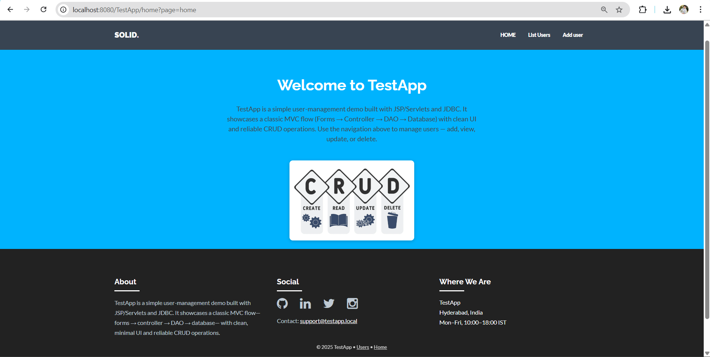
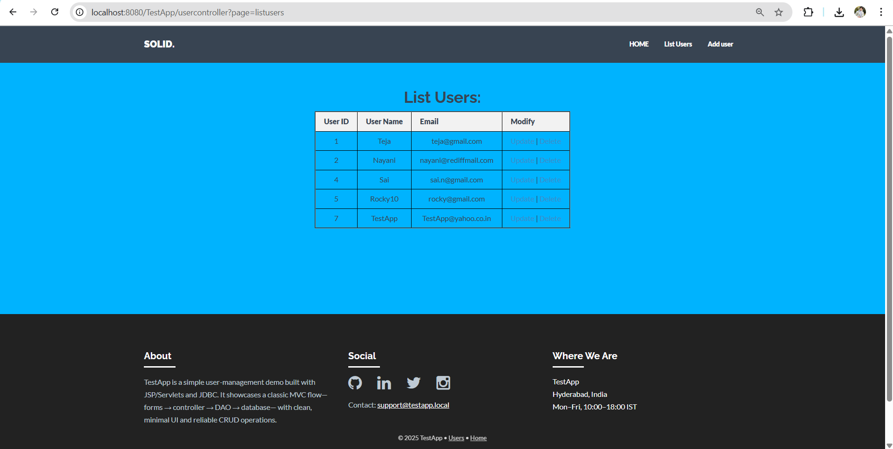
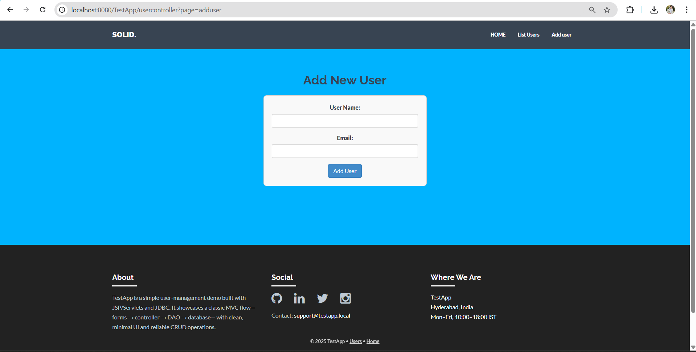
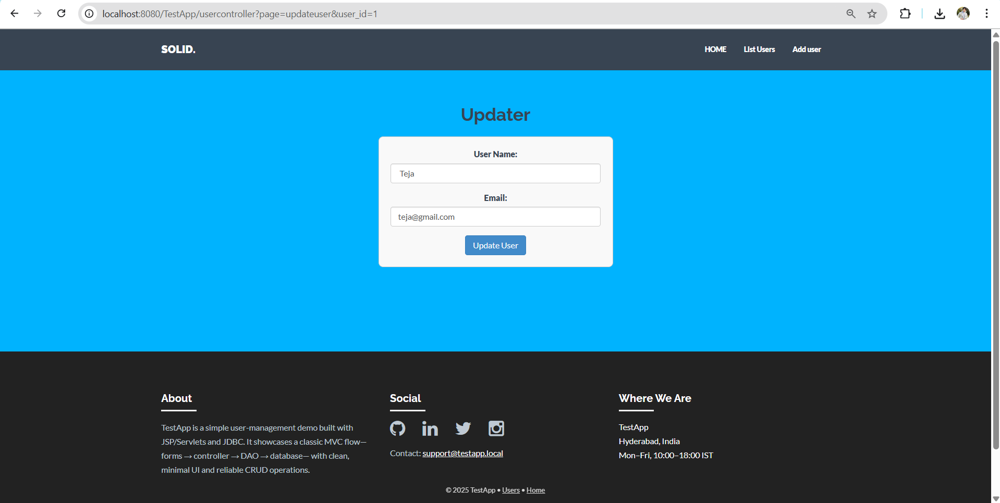

# TestApp -- User Management System

A simple **user-management web application** built with **JSP, Servlets,
JDBC, and MVC architecture**.\
It demonstrates CRUD operations (Create, Read, Update, Delete) with a
**clean UI, database connectivity, and structured MVC flow**.

------------------------------------------------------------------------

## 🚀 Features

-   Add new users with validation\
-   List all users in a clean table view\
-   Update existing user details\
-   Delete users safely\
-   MVC Pattern: **JSP (View) → Servlet Controller → DAO → Database**\
-   Minimal Bootstrap-based UI with reusable header/footer

------------------------------------------------------------------------

## 🛠️ Tech Stack

-   **Frontend**: JSP, HTML5, CSS3, Bootstrap\
-   **Backend**: Java Servlets, JDBC\
-   **Database**: MySQL\
-   **Build Tool**: Maven\
-   **Server**: Apache Tomcat (v10.x)

------------------------------------------------------------------------

## 📂 Project Structure

    src/
     ├── main/
     │   ├── java/
     │   │    └── org.studyeasy/...
     │   ├── resources/
     │   └── webapp/
     │        ├── assets/        # CSS, JS, Images
     │        ├── include/       # header.jsp, footer.jsp
     │        ├── WEB-INF/       # web.xml
     │        ├── adduser.jsp
     │        ├── updateuser.jsp
     │        ├── listusers.jsp
     │        ├── userform.jsp
     │        ├── index.jsp
     │        └── error.jsp

------------------------------------------------------------------------

## ⚙️ Setup Instructions

1.  **Clone this repo**

    ``` bash
    git clone https://github.com/Teja-x/TestApp.git
    cd TestApp
    ```

2.  **Import into Eclipse/IntelliJ** as a **Maven project**.

3.  **Configure Database**

    -   Create a MySQL database:

        ``` sql
        CREATE DATABASE testappdb;
        USE testappdb;
        CREATE TABLE users (
          user_id INT PRIMARY KEY AUTO_INCREMENT,
          username VARCHAR(100) NOT NULL,
          email VARCHAR(100) NOT NULL
        );
        ```

    -   Update DB connection in `DatabaseConfig.java`.

4.  **Deploy on Tomcat**

    -   Run on Apache Tomcat v10.x\
    -   Access at: `http://localhost:8080/TestApp`

------------------------------------------------------------------------

## 📸 Screenshots

### 🏠 Homepage



### 👥 List Users



### ➕ Add User



### ✏️ Update User



------------------------------------------------------------------------

## 📚 Learning Outcomes

-   Hands-on practice with **Servlets, JSP, JSTL, JDBC**\
-   Understanding of **MVC architecture in Java EE**\
-   Practical CRUD implementation with **DAO pattern**\
-   Bootstrap integration for clean UI\
-   Deployment of a Maven project on **Apache Tomcat**

------------------------------------------------------------------------

## 👨‍💻 Author

**Teja Sai Nayani**\
- GitHub: [Teja-x](https://github.com/Teja-x)\
- LinkedIn: [Teja Nayani](https://www.linkedin.com/in/teja-nayani/)

------------------------------------------------------------------------

⚡ This project is a part of my **Java Full Stack Development journey**
--- showcasing core backend concepts before diving into Spring Boot &
React.
